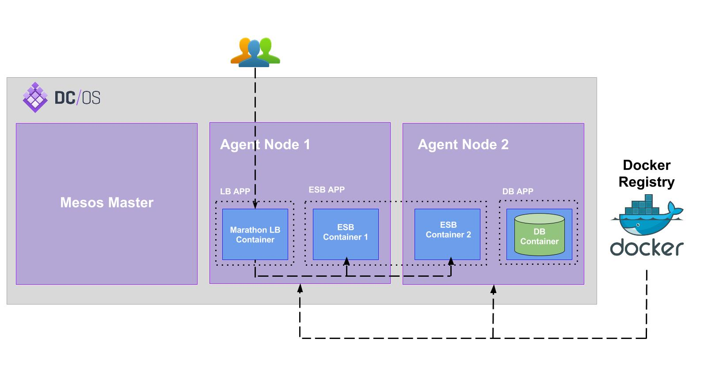

# WSO2 Mesos Artifacts

WSO2 Mesos Artifacts enables you to run WSO2 middleware seamlessly on [Mesos DC/OS](https://dcos.io/) using Docker. This
repository contains Carbon Mesos membership scheme, Marathon applications and deployment automation scripts required for
executing a complete WSO2 middleware deployment on Mesos DC/OS.

## Getting Started

To deploy a WSO2 product on Mesos DC/OS, follow the below steps:
* Build WSO2 product Docker images using [WSO2 Dockerfiles](https://github.com/wso2/dockerfiles).
* Load above Docker images to Mesos slave nodes or import them to a central Docker registry.
* If a central Docker registry is used, update Docker image tags accordingly in WSO2 Marathon applications.
* Run `deploy.sh` inside the relevant product folder. This will deploy following Marathon applications:
   * Marathon load balancer
   * Governance Registry database
   * User Management database
   * Product's Configuration Registry database
   * Product default profile

>In the context of this document, `MESOS_HOME`, `DOCKERFILES_HOME` and `PUPPET_HOME` will refer to local copies of [`wso2/mesos-artifacts`](https://github.com/wso2/mesos-artifacts/), [`wso2/dockcerfiles`](https://github.com/wso2/dockerfiles/) and [`wso2/puppet-modules`](https://github.com/wso2/puppet-modules) repositories respectively.

## Documentation
* [WSO2 Mesos Artifacts Wiki](https://docs.wso2.com/display/MA100/Home)
